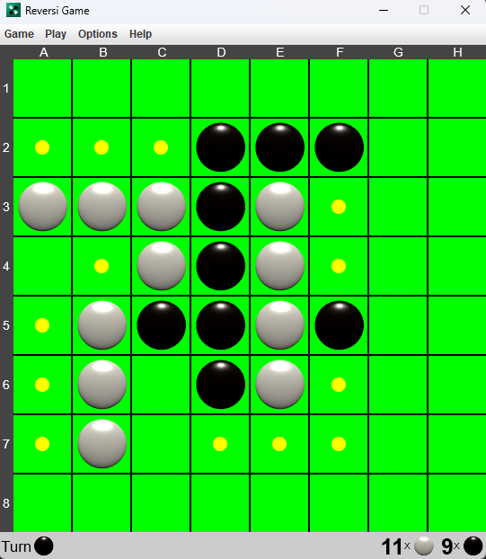

# Reversi Desktop App

Welcome to the Reversi Desktop App! This is a simple implementation of the classic Reversi (Othello) board game.

| Play Mode                               |
|-----------------------------------------|
|  |

## Features

- Play against a friend online in Multiplayer mode.
- Play against a friend in your computer in Single Player mode.
- Enjoy a clean and intuitive user interface.

## Getting Started

Follow these steps to get the project up and running on your local machine.

### Prerequisites

- [Kotlin](https://kotlinlang.org/) programming language.
- [Java Development Kit (JDK)](https://www.oracle.com/java/technologies/javase-downloads.html).
- A compatible IDE (e.g., [IntelliJ IDEA](https://www.jetbrains.com/idea/)).

### Installation

1. Clone the repository to your local machine:
   - git clone https://github.com/your-username/reversi-desktop-app.git

2. Open the project in your preferred IDE.

3. Build and run the application from the IDE.

## Usage

1. Launch the app.

2. Choose your preferred mode:
- **Single Player**: Play against a friend locally.
- **Multiplayer**: Play against a friend online.

3. Follow the on-screen instructions to take your turns.

4. Enjoy the game!

## Acknowledgments

- Inspired by the classic Reversi (Othello) board game.
- Thank you to my teammates [Gonçalo Frutuoso](https://github.com/Gongamax) 
and [Francisco Saraiva](https://github.com/saraiva22) for their contributions and 
support during this project.

---

Instituto Superior de Engenharia de Lisboa 
BSc in Computer Science and Engineering 
Software Development Techniques 
Winter Semester of 2022/2023